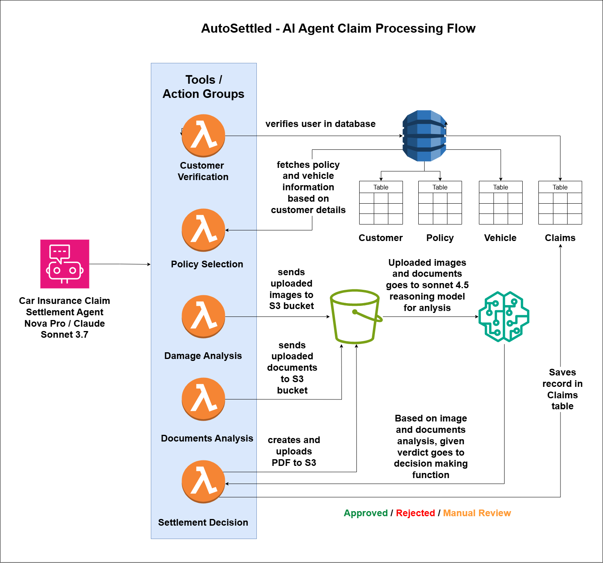

# AutoSettled - AI-Powered Car Insurance Claims Processing

An intelligent AI-powered car insurance claims processing system built with AWS Bedrock Agents, Lambda functions, and DynamoDB.

## 📺 Demo Video

[](https://youtu.be/Khdmf830ow8)

**[Watch the full demo on YouTube →](https://youtu.be/Khdmf830ow8)**



## Overview

AutoSettled implements a conversational AI agent that guides users through a 5-step car insurance claim filing process:

1. **Customer Verification** - Verify identity using name and email
2. **Policy Verification** - Validate policy status and coverage
3. **Damage Analysis** - Analyze damage images using AI vision
4. **Document Analysis** - Process police reports and repair estimates
5. **Settlement Decision** - Generate comprehensive claim decision with reasoning

## Features

### Intelligent Verification
- Customer identity validation via DynamoDB lookup
- Policy status and expiration checking
- Customer-policy relationship validation

### AI-Powered Damage Analysis
- Visual analysis of car damage using Claude 4.5 Sonnet vision
- Vehicle matching (compares images to policy vehicle details)
- Estimated repair cost calculation
- Crash reason analysis and damage severity assessment

### Document Processing
- Automated text extraction
- Police report and repair estimate analysis
- Cross-verification between documents and images
- Fraud indicator detection

### Comprehensive Settlement Decision
- Multi-factor claim analysis with risk assessment
- Genuine vs suspicious factors identification
- Detailed reasoning with supporting evidence
- Approval/denial recommendations with cost breakdown

## Architecture

```
┌─────────────────────────────┐
│   Bedrock Agent             │
│   (Claude Nova Pro)         │
└──────────┬──────────────────┘
           │
           ├──► customerVerification (Lambda)
           ├──► policyVerification (Lambda)
           ├──► analyzeDamageImages (Lambda)
           ├──► analyzeDocuments (Lambda)
           └──► generateSettlementDecision (Lambda)
                      │
                      ▼
           ┌──────────────────────┐
           │   DynamoDB Tables     │
           ├──────────────────────┤
           │ • customers          │
           │ • policies           │
           │ • vehicles           │
           │ • claims-records     │
           └──────────────────────┘
```

## Project Structure

```
autosettled/
├── README.md                           # Project documentation
├── requirements.txt                    # Python dependencies
│
├── scripts/                            # Deployment scripts
│   ├── deploy_agent.py                # Bedrock agent deployment
│   └── deploy_frontend.py             # Frontend deployment
│
├── infrastructure/                     # Infrastructure as Code
│   ├── template.yaml                  # SAM/CloudFormation template
│   ├── samconfig.toml                 # SAM configuration
│   └── bedrock/
│       └── agent_config.json          # Bedrock agent configuration
│
├── backend/                            # Backend Lambda functions
│   ├── lambda_functions/
│   │   ├── apiOrchestrator/
│   │   ├── customerVerification/
│   │   ├── policyVerification/
│   │   ├── analyzeDamageImages/
│   │   ├── analyzeDocuments/
│   │   ├── generateSettlementDecision/
│   │   └── fileUpload/
│   └── layers/                        # Lambda layers
│       └── pdf_generation/
│
├── frontend/                           # React web application
│   ├── src/
│   ├── public/
│   └── package.json
│
└── data/                               # Data management
    ├── dummy_data/                    # Sample data CSVs
    └── scripts/
        └── load_dummy_data.py         # Data loading utility
```

## Prerequisites

- **AWS Account** with access to:
  - Amazon Bedrock (Claude Nova Pro & Claude Models)
  - AWS Lambda
  - Amazon DynamoDB
  - Amazon S3
  - CloudFront
- **Python 3.10+**
- **Node.js 18+** (for frontend)
- **AWS CLI** configured with credentials
- **AWS SAM CLI** installed

## Quick Start

### 1. Clone the Repository

```bash
git clone <your-repo-url>
cd autosettled
```

### 2. Configure AWS Credentials

```bash
aws configure
# Enter your AWS Access Key ID, Secret Access Key, and region (us-east-1 recommended)
```

### 3. Install Python Dependencies

```bash
pip install -r requirements.txt
```

### 4. Deploy Backend Infrastructure

```bash
cd infrastructure
sam build
sam deploy --guided
cd ..
```

On first deploy, you'll be prompted for:
- Stack name (default: `autosettled-stack`)
- AWS Region (default: `us-east-1`)
- Confirm changes before deploy
- Allow SAM CLI IAM role creation

### 5. Deploy Bedrock Agent

```bash
cd scripts
python deploy_agent.py
cd ..
```

This will:
- Create IAM role for the agent
- Deploy the Bedrock agent with Claude Nova Pro
- Configure action groups linked to Lambda functions
- Output the Agent ID and Alias ID
- **Automatically update CloudFormation stack** with the agent ID (when you answer "yes")

The script will ask if you want to update the stack. Answer **yes** to automatically configure your Lambda functions with the new agent ID.

### 6. Load Sample Data

```bash
cd data/scripts
python load_dummy_data.py
cd ../..
```

### 7. Deploy Frontend

```bash
cd scripts
python deploy_frontend.py
cd ..
```

This will:
- Build the React application
- Upload to S3
- Deploy via CloudFront
- Output the frontend URL

## Usage

Access the frontend URL provided after deployment. The application provides a chat interface to:

1. Enter customer details for verification
2. Select or enter policy information
3. Upload damage photos
4. Upload police report and repair estimate
5. Receive AI-generated settlement decision

## Technology Stack

- **AWS Bedrock** - AI foundation models (Claude Nova Pro & Claude 3.5 Sonnet)
- **AWS SAM** - Serverless Application Model for IaC
- **AWS Lambda** - Serverless compute (Python 3.10)
- **Amazon DynamoDB** - NoSQL database
- **Amazon S3** - Object storage
- **Amazon CloudFront** - CDN for frontend
- **React + TypeScript** - Frontend framework
- **Vite** - Frontend build tool

## Configuration

### Environment Variables

Copy `.env.example` to `.env` and configure:

```bash
AWS_REGION=us-east-1
AWS_ACCOUNT_ID=<your-account-id>
```

### Region Configuration

The default region is `us-east-1`. To deploy to a different region:

```bash
cd infrastructure
sam deploy --region <your-region>
```

**Note:** Ensure Claude models are available in your chosen region.

## Development

### Running Frontend Locally

```bash
cd frontend
npm install
npm run dev
```

### Testing Lambda Functions Locally

```bash
cd infrastructure
sam local invoke <FunctionName> -e events/test-event.json
```

### Updating Lambda Code

After modifying Lambda functions:

```bash
cd infrastructure
sam build
sam deploy
```

## Contributing

Contributions are welcome! Please:

1. Fork the repository
2. Create a feature branch
3. Make your changes
4. Submit a pull request

## License

This project is provided as-is for educational and demonstration purposes.

## Acknowledgments

Built with AWS Bedrock Agents and Claude AI by Anthropic.

---

For questions or issues, please open a GitHub issue.
